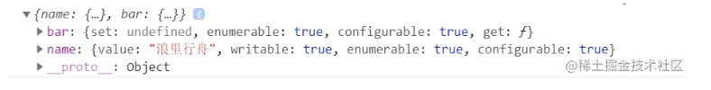
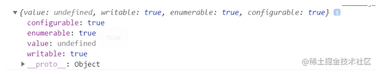
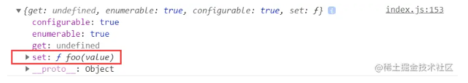
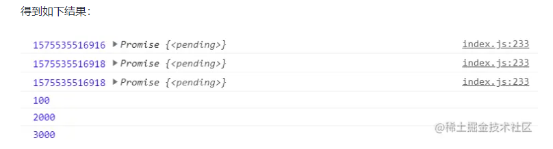

### ES7 新特性

#### Array.prototype.includes()方法

在 ES6 中我们有 String.prototype.includes() 可以查询给定字符串是否包含一个字符，而在 ES7 中，我们在数组中也可以使用 Array.prototype.includes() 方法来判断一个数组是否包含一个给定的值，根据情况，如果包含则返回 true，否则返回 false。

```js
const arr = [1, 2, 3, 4, 5, "9", NaN, -0];
arr.includes(1); // true
arr.includes(1, 2); // false 该方法的第二个参数表示搜索的其实位置，默认为0
arr.includes("1"); // false
arr.includes(NaN); // true
arr.includes(+0); // true
```

除此之外，还可以使用 indexOf()、find()和 findIndex()
indexOf()方法返回在数组中可以找到一个给定元素的第一个索引，如果不存在，则返回-1。注意，这三个方法内部使用严格相等运算符(===)进行判断，这会导致对 NaN 的误判。

```js
[NaN].indexOf(NaN); // -1

[1, 2, -5, 10].find((n) => n < 0); // -5
[1, 5, 10, 15].findIndex((value) => {
  return value > 9;
}); // 2
[NaN].findIndex((y) => Object.is(NaN, y)); // 0
```

#### 求幂运算符

在 ES7 中引入了指数运算符，具有与 Math.pow() 等效的计算结果

```js
console.log(2 ** 10); // 1024
console.log(Math.pow(2, 10)); // 1024
```

### ES8 新特性

#### Async / Await

async 是一个通过异步执行并隐式返回 Promise 作为结果的函数。

```js
async function foo() {
  return "111";
}
foo().then((val) => {
  console.log(val); // '111'
});
```

上述代码，可以看到调用 async 声明的 foo 函数返回了一个 Promise 对象，等价于下面代码：

```js
async function foo() {
  return Promise.resolve("111");
}
foo().then((val) => {
  console.log(val); // '111'
});
```

#### Object.values()，Object.entries()

ES5 引入了 Object.keys 方法，返回一个数组，成员是参数对象自身的(不含继承的)所有可遍历属性的键名。ES8 引入了跟 Object.keys 配套的 Object.values 和 Object.entries，作为一个对象的补充手段，供 for...of 循环使用。

```js
const obj = { foo: "bar", baz: 42 };
Object.values(obj); // ["bar", 42]
const obj = { 100: "a", 2: "b", 7: "c" };
Object.values(obj); // ["b", "c", "a"]
```

注意：如果属性名为数值的属性，是按照数值大小，从小到大遍历的，因此返回的顺序是 b、c、a。
Object.entries() 方法返回一个数组，成员是参数对象自身的（不含继承的）所有可遍历属性的键值对数组。

```js
const obj = { foo: "bar", baz: 42 };
Object.entries(obj); // [['foo','bar'],['baz', 42]]
const obj = { 10: "xxx", 1: "yyy", 3: "zzz" };
Object.entries(obj); // [['1','yyy'],[3,'zzz'],['10','xxx']]
```

#### String padding

String 新增了两个实例函数 String.prototype.padStart 和 String.prototype.padEnd，允许将空字符串或其他字符串添加到原始字符串的开头或结尾。

```js
String.padStart(targetLength, [padString]);
```

targetLength(必填)：当前字符串需要填充到的目标长度。如果这个数值小于当前字符串的长度，则返回当前字符串本身。
padString(可选)：填充字符串。如果字符串太长，使填充后的字符串长度超过了目标长度，则只保留最左侧的部分，其他部分会被截断，此参数缺省值为""。

```js
"x".padStart(4, "ab"); // 'abax'
"x".padEnd(5, "ab"); // 'xabab'
```

有时候我们处理日期、金额的时候经常要格式化，这个特性就派上了用场：

```js
"12".padStart(10, "YYYY-MM-DD"); // "YYYY-MM-12"
"09-12".padStart(10, "YYYY-MM-DD"); // "YYYY-09-12"
```

#### Object.getOwnPropertyDescriptors()

ES5 的 Object.getOwnPropertyDescriptor() 方法会返回某个对象属性的描述对象(descriptor)。ES8 引入了 Object.getOwnPropertyDescriptors() 方法，返回指定对象所有自身属性(非继承属性)的描述对象。

```js
const obj = {
  name: "浪里行舟",
  get bar() {
    return "abc";
  },
};
console.log(Object.getOwnPropertyDescriptors(obj));
```


该方法的引入目的，主要是为了解决 Object.assign() 无法正确拷贝 get 属性和 set 属性的问题。

```js
const source = {
  set foo(value) {
    console.log(value);
  },
  get bar() {
    return "浪里行舟";
  },
};
const target1 = {};
Object.assign(target1, source);
console.log(Object.getOwnPropertyDescriptor(target1, "foo"));
```



上面代码中，source 对象的 foo 属性的值是一个赋值函数，Object.assign 方法将这个属性拷贝给 target1 对象，结果该属性的值变成了 undefined。**这是因为 Object.assign 方法总是拷贝一个属性的值，而不会拷贝它背后的赋值方法或取值方法**。
这时，Object.getOwnPropertyDescriptors() 方法配合 Object.defineProperties()方法，就可以实现正确的拷贝。

```js
const source = {
  set foo(value) {
    console.log(value);
  },
  get bar() {
    return "浪里行舟";
  },
};
const target2 = {};
Object.defineProperties(target2, Object.getOwnPropertyDescriptors(source));
console.log(Object.getOwnPropertyDescriptor(target2, "foo"));
```



### ES9 新特性

#### for await of

for of 方法能够遍历具有 Symbol.iterator 接口的同步迭代器数据，但是不能遍历异步迭代器。ES9 新增的 for await of 可以用来遍历具有 Symbol.asyncIterator 方法的数据结构，也就是异步迭代器，且会等待前一个成员的状态改变后才会遍历到下一个成员，相当于 async 函数内部的 await。

```js
// for of遍历
function Gen(time) {
  return new Promise(function (resolve, reject) {
    setTimeout(function () {
      resolve(time);
    }, time);
  });
}
async function test() {
  let arr = [Gen(2000), Gen(100), Gen(3000)];
  for (let item of arr) {
    console.log(Date.now(), item.then(console.log));
  }
}
test();
```



上述代码证实了 for of 方法不能遍历异步迭代器，得到的结果并不是我们所期待的，于是 for await of 就出现了。

```js
function Gen(time) {
  return new Promise(function (resolve, reject) {
    setTimeout(function () {
      resolve(time);
    }, time);
  });
}
async function test() {
  let arr = [Gen(2000), Gen(100), Gen(3000)];
  for await (let item of arr) {
    console.log(Date.now(), item);
  }
}
test();
// 1575536194608 2000
// 1575536194608 100
// 1575536195608 3000
```

使用 for await of 遍历时，会等待前一个 Promise 对象的状态改变后，再遍历到下一个成员。

### ES10 新特性

#### Array.prototype.flat()

多维数组时一种常见的数据格式，特别是在进行数据检索的时候。将多维数组打平是常见的需求。
flat() 方法会按照一个可指定的深度递归遍历数组，并将所有元素与遍历到的子数组中的元素合并为一个新数组返回。

```js
newArray = arr.flat(depth); // depth是指要提取嵌套数组的结构深度，默认值为1
```

```js
const numbers1 = [1, 2, [3, 4, [5, 6]]];
console.log(numbers1.flat()); // [1, 2, 3, 4, [5, 6]]
const numbers2 = [1, 2, [3, 4, [5, 6]]];
console.log(numbers2.flat(2)); // [1, 2, 3, 4, 5, 6]
```

#### Array.prototype.flatMap()

flatMap() 方法首先使用映射函数映射每个元素，然后将结果压缩成一个新数组。从方法的名字也可以看出来包含两部分功能一个是 map，一个是 flat(深度为 1)。

```js
let arr = [1, 2, 3];
console.log(arr.map((item) => [item * 2]).flat()); // [2, 4, 6]
console.log(arr.flatMap((item) => [item * 2])); // [2, 4, 6]
```

实际上，flatMap 是综合了 map 和 flat 的操作，所以它只能打平一层。

#### Object.fromEntries()

Object.fromEntries 这个新的 API 实现了与 Object.entries 相反的操作。这使得根据对象的 entries 很容易得到 object。

```js
const object = { x: 23, y: 24 };
const entries = Object.entries(object); // [['x', 23], ['y', 24]]
const result = Object.fromEntries(entries); // { x: 23, y: 24 }
```

ES2017 引入了 Object.entries，这个方法可以将对象转换为数组，这样对象就可以使用数组原型中的众多内置方法，比如 map、filter、reduce，举个栗子，我们想提取下列对象 obj 中所有 value 大于 21 的键值对，如何操作呢？

```js
// ES10之前
const obj = {
  a: 21,
  b: 22,
  c: 23,
};
console.log(Object.entries(obj)); // [['a',21],["b", 22],["c", 23]]
let arr = Object.entries(obj).filter(([a, b]) => b > 21); // [["b", 22],["c", 23]]
let obj1 = {};
for (let [name, age] of arr) {
  obj1[name] = age;
}
console.log(obj1); // {b: 22, c: 23}
```

上例中得到了数组 arr，想再次转换为对象，就需要手动写一些代码来处理，但是有了 Object.fromEntries() 就很容易实现。

```js
// 用Object.fromEntries()来实现
const obj = {
  a: 21,
  b: 22,
  c: 23,
};
let res = Object.fromEntries(Object.entries(obj).filter(([a, b]) => b > 21));
console.log(111, res); // {b: 22, c: 23}
```

#### String.trimStart 和 String.trimEnd

移除开头和结尾的空格，之前我们用正则表达式来实现，现在 ES10 新增了两个新特性，让这变得更简单！
trimStart() 方法从字符串的开头删除空格，trimLeft()是此方法的别名。

```js
let str = " 前端工匠 ";
console.log(str.length); // 6
str = str.trimStart();
console.log(str.length); // 5
let str1 = str.trim(); // 清除前后的空格
console.log(str1.length); // 4
str.replace(/^\s+/g, ""); // 也可以用正则实现开头删除空格
```

trimEnd() 方法从一个字符串的右端移除空白字符，trimRight 是 trimEnd 的别名。

```js
let str = " 浪里行舟 ";
console.log(str.length); // 6
str = str.trimEnd();
console.log(str.length); // 5
let str1 = str.trim(); //清除前后的空格
console.log(str1.length); // 4
str.replace(/\s+$/g, ""); // 也可以用正则实现右端移除空白字符
```

#### BigInt

js 所有数字都保存为 64 位浮点数，这给数值的表示带来了两大限制。一是数值的精度只能到 53 个二进制位，大于这个范围的整数，js 是无法精确表示的。二是大于或等于 2 的 1024 次方的数值，js 无法表示，会返回 Infinity。

```js
// 超过 53 个二进制位的数值，无法保持精度
Math.pow(2, 53) === Math.pow(2, 53) + 1; // true
// 超过 2 的 1024 次方的数值，无法表示
Math.pow(2, 1024); // Infinity
```

现在 ES10 引入了一种新的数据类型 BigInt（大整数），来解决这个问题。BigInt 只用来表示整数，没有位数的限制，任何位数的整数都可以精确表示。
创建 BigInt 类型的值也非常简单，只需要在数字后面加上 n 即可。例如，123 变为 123n。也可以使用全局方法 BigInt(value) 转化，入参 value 为数字或数字字符串。

```js
const aNumber = 111;
const aBigInt = BigInt(aNumber);
aBigInt === 111n; // true
typeof aBigInt === "bigint"; // true
typeof 111; // "number"
typeof 111n; // "bigint"
```

如果算上 BigInt，JavaScript 中原始类型就从 6 个变为了 7 个。

#### Function.prototype.toString()

ES2019 中，Function.toString()发生了变化。之前执行这个方法时，得到的字符串是去空白符号的。而现在，得到的字符串呈现出原本源码的样子：

```js
function sum(a, b) {
  return a + b;
}
console.log(sum.toString());
// function sum(a, b) {
//  return a + b;
// }
```
