# grid布局

grid布局，也被称之为网格布局，是将页面中的父元素划分成一个个小格子，然后通过这些小格子进行合并来制作出不同的网站效果。


## 栅格介绍

## 关键词

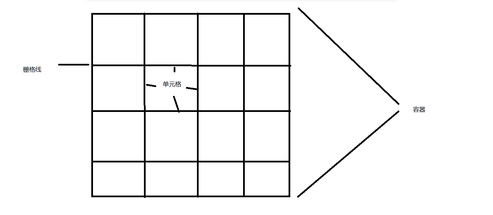

## 兼容性

 https://caniuse.com/

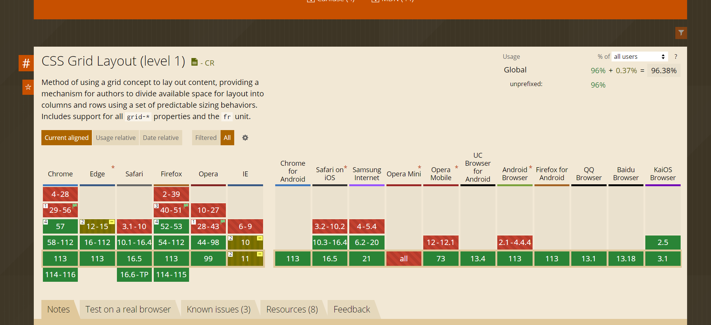

## 网格线

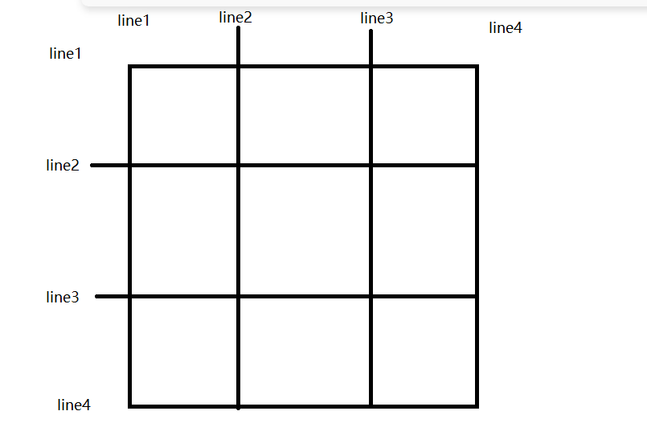

通过上图我们能看到一个3*3的网格，拥有4条横向网格线和4条纵向的网格线组成。

如果需要绘制一个m行n列的网格，需要使用m+1条横向，n+1条纵向网格线。

## 声明容器-如何触发网格

给父元素添加display属性，并将取值设置为grid / inline-grid，grid代表的是块状网格，默认独占一行，类似于块元素；inline-grid：代表的是行内块网格，与行内元素类似。

display: grid;   // 块级容器

display: inline-grid;  // 行级容器

```css
<!DOCTYPE html>
<html lang="en">
  <head>
    <meta charset="UTF-8" />
    <meta http-equiv="X-UA-Compatible" content="IE=edge" />
    <meta name="viewport" content="width=device-width, initial-scale=1.0" />
    <title>grid</title>
    <style>
      * {
        padding: 0;
        margin: 0;
      }

      body {
        padding: 200px;
      }

      article {
        width: 400px;
        height: 200px;
        border: solid 5px silver;
        display: grid;
        grid-template-rows: 50% 50%;
        grid-template-columns: 25% 25% 25% 25%;
      }

      article div {
        background: blueviolet;
        background-clip: content-box;
        padding: 10px;
        border: solid 1px #ddd;
      }
    </style>
  </head>
  <body>
    <span>111</span>
    <article>
      <div></div>
      <div></div>
      <div></div>
      <div></div>
      <div></div>
      <div></div>
      <div></div>
      <div></div>
    </article>
    <span>222</span>
  </body>
</html>

```

## 划分行列

栅格有点类似于表格，也有行和列。使用`grid-template-columns`规划可划分列数，使用`grid-template-rows`划分行数。

后面跟了几组值，代表了几行几列。

### 固定宽度

```css
display: grid; 
grid-template-rows: 100px 100px;
grid-template-columns: 100px 100px 100px;

// 代表了两行三列的网格，每一行行高100px，每一列列宽100px。
```

```html
<!DOCTYPE html>
<html lang="en">
  <head>
    <meta charset="UTF-8" />
    <meta http-equiv="X-UA-Compatible" content="IE=edge" />
    <meta name="viewport" content="width=device-width, initial-scale=1.0" />
    <title>grid</title>
    <style>
      * {
        padding: 0;
        margin: 0;
      }

      body {
        padding: 200px;
      }

      article {
        width: 300px;
        height: 200px;
        border: solid 5px #ccc;
        display: grid;
        grid-template-rows: 100px 100px;
        grid-template-columns: 100px 100px 100px;
      }

      article div {
        background: blueviolet;
        background-clip: content-box;
        padding: 10px;
        border: solid 1px #ddd;
      }
    </style>
  </head>
  <body>
    <article>
      <div></div>
      <div></div>
      <div></div>
      <div></div>
      <div></div>
      <div></div>
    </article>
  </body>
</html>
```


### 百分比

```css
display: grid;
grid-template-rows: 50% 50%;
grid-template-columns: 25% 25% 25% 25%;
```

### 重复设置

使用 `repeat`统一设置值，第一个参数为重复数量，第二个参数是重复值。

```css
grid-template-rows: repeat(2, 50%);
grid-template-columns: repeat(4, 25%);
```

可以设置多个值来定义重复，下面定义了四列，以100px，50px重复排列。

```css
display: grid;
grid-template-rows: repeat(2, 50%);
grid-template-columns: repeat(2, 100px 50px);
```

### 自动填充

自动填充是根据容器尺寸，自动设置元素。

```css
grid-template-rows: repeat(auto-fill, 100px);
grid-template-columns:repeat(auto-fill, 30%);

// 这里auto-fill会将列数宽度按照30%的宽度进行划分，盛放不下的话则不在划分列数。
```

列数剩余10%存放不下，不在划分列数，自动换行。

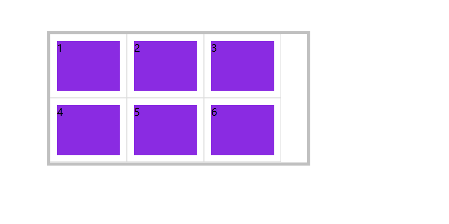


```css
width: 300px;
height: 200px;
display: grid;
grid-template-rows: repeat(auto-fill, 100px);
grid-template-columns: repeat(auto-fill, 100px);
```

### 比例划分

使用`fr`单位设置元素在空间中所占的比例，下面按1份-2份分成两组共4列。

#### 单位组合

```css
width: 300px;
height: 200px;
display: grid;
grid-template-rows: 1fr 2fr;
grid-template-columns: 100px 1fr 2fr; // 除去100px固定，剩下的平分成3份
```

#### 重复定义
```css
width: 300px;
height: 100px;
display: grid;
grid-template-rows: repeat(2, 1fr);
grid-template-columns: repeat(2, 1fr 2fr);
```
### 自动空间-auto自动
```css
display: grid;
grid-template-rows: repeat(2, 1fr);
grid-template-columns: 100px auto 30px;
```
### 组合定义  
`grid-tempalte` 是 `grid-template-rows`、`grid-template-columns`属性的简写。

```css
display: grid;
grid-template: repeat(3, 100px) / repeat(3, 100px);
```
下面是使用` grid-template` 同时声明 `grid-template-rows`、`grid-template-columns`。
```css
display: grid;
grid-template: 30px 40px 50px/ 30px 1fr;
```
下面是使用`grid-template`定义` grid-template-areas` ，有关`grid-template-areas`的使用方法会在下面介绍。

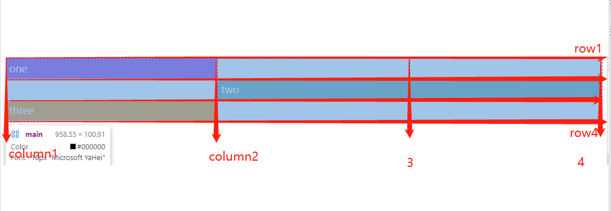

```html
<style>
  main {
    display: grid;
  }
  div {
    background: blueviolet;
    border: solid 1px #ddd;
    color: white;
    padding: 5px;
  }
  div:nth-child(2) {
    /* grid-area: grid-row-start / grid-column-start / grid-row-end / grid-column-end | itemname; */
    grid-area: 2/2/3/4;
    background-color: cadetblue;
  }
  div:nth-child(3) {
    grid-area: 3/1/4/2;
    background-color: darkorange;
  }
</style>
<main>
  <div href="">one</div>
  <div href="">two</div>
  <div href="">three</div>
</main>
```
### minmax
使用`minmax`方法可以设置取值范围，下列在行高在`最小50px~最大100px`间取值，列在50~150之间。

如果条件允许，则一直使用最大值，如果条件不满足则使用中间值，如果剩下的距离不足以显示距离大小，则使用最小值。

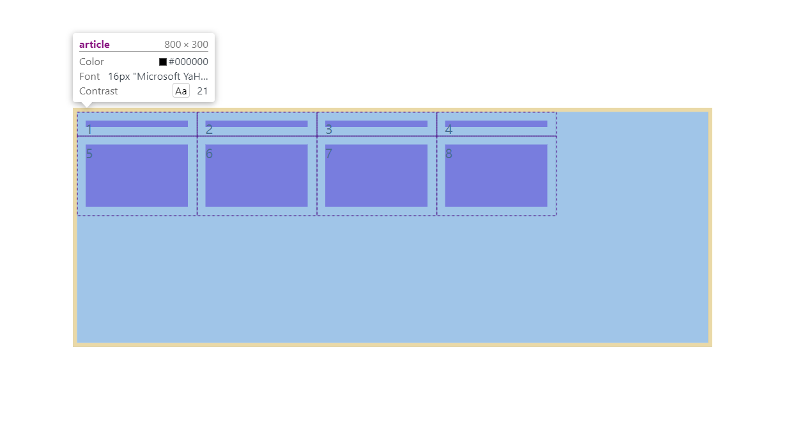

```css
width: 800px;
height: 300px;
border: solid 5px silver;
display: grid;
grid-template-rows: 30px minmax(50px, 100px);
grid-template-columns: repeat(4, minmax(50px, 150px));
```
## 间距定义
### 行间距
使用` row-gap` 设置行间距。
```css
display: grid;
grid-template-rows: repeat(2, 1fr);
grid-template-columns: repeat(3, 1fr);
row-gap: 30px;
```
### 列间距
使用 `column-gap` 定义列间距。
```css
display: grid;
grid-template-rows: repeat(2, 1fr);
grid-template-columns: repeat(3, 1fr);
column-gap: 20px;
```
### 组合定义
使用 `gap` 规则可以一次定义行、列间距，如果间距一样可以只设置一个值。
```css
display: grid;
grid-template-rows: repeat(2, 1fr);
grid-template-columns: repeat(3, 1fr);
gap: 20px 10px;
```
统一设置行列间距为 20px
```css
gap: 20px;
```
## 栅格命名

栅格线可以使用命名与编号找到，方便控制指定栅格，或将内容添加到指定栅格中。

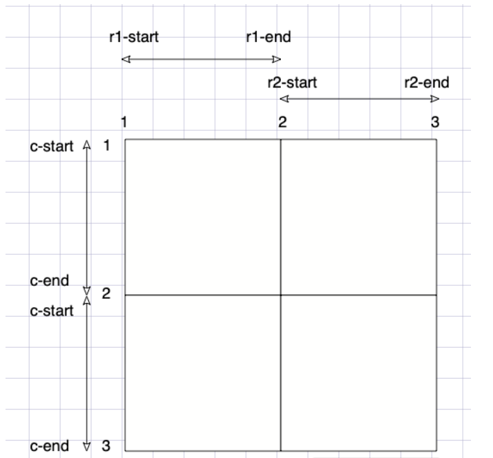


### 独立命名
```css
display: grid;
grid-template-rows: [r1-start] 50px [r1-end r2-start] 100px [r2-end r3-start] 150px [r3-end];
grid-template-columns: [c1-start] 100px [c1-end c2-start] 100px [c2-start c3-start] 100px [c3-end];
```
### 自动命名
```css
display: grid;
grid-template-rows: repeat(3, [r-start] 100px [r-end]);
grid-template-columns: repeat(3, [c-start] 100px [c-end]);
```


## 元素定位

| 样式属性          | 说明         |
| ----------------- | ------------ |
| grid-row-start    | 行开始栅格线 |
| grid-row-end      | 行结束栅格线 |
| grid-column-start | 列开始栅格线 |
| grid-column-end   | 列结束栅格线 |

上面几个样式属性可以使用以下值。

| 属性值        | 说明                               |
| ------------- | ---------------------------------- |
| Line          | 栅格线                             |
| span 数值     | 栅格包含的栅格数量                 |
| span 区域名称 | 栅格包含到指定的区域名称           |
| auto          | 自动设置，默认为一个网格宽度和高度 |

### 根据栅格线

通过设置具体的第几条栅格线来设置区域位置，设置的数值可以是正数和负数。
```css
<style>
    * {
        padding: 0;
        margin: 0;
    }

    body {
        padding-left: 200px;
        padding-top: 200px;
    }

    article {
        border: solid 5px blueviolet;
        width: 400px;
        height: 400px;
        display: grid;
        grid-template-rows: repeat(4, 1fr);
        grid-template-columns: repeat(4, 1fr);
    }

    article div {
        background: blueviolet;
        grid-row-start: 2;
        grid-row-end: 4;
        grid-column-start: 2;
        grid-column-end: 4;
        display: flex;
        justify-content: center;
        align-items: center;
        font-size: 35px;
        color: white;
    }
</style>
```

### 根据栅格命名

```css
article {
	width: 300px;
	height: 300px;
	border: solid 5px #ccc;
	display: grid;
	grid-template-rows: [r1-start] 100px [r1-end r2-start] 100px [r2-end r3-start] 100px [r3-end];
	grid-template-columns: [c1-start] 100px [c1-end c2-start] 100px [c2-end c3-start] 100px [c3-end];
}
article div {
	background: blueviolet;
	background-clip: content-box;
	grid-row-start: r1-end;
	grid-column-start: c2-start;
	grid-row-end: r3-start;
	grid-column-end: c3-start;
}
```


### 根据自动命名  简写模式

```css
article {
	width: 300px;
	height: 300px;
	border: solid 5px #ccc;
	display: grid;
	grid-template-rows: repeat(3, [r-start] 100px [r-end]);
	grid-template-columns: repeat(3, [c-start] 100px [c-end]);
}
article div {
	background: blueviolet;
  background-clip: content-box;
  grid-row-start: r-start 2;  // 开始线 第几条线  第二行的开始线
  grid-column-start: c-start 2;
  grid-row-end: r-end 3;
  grid-column-end: c-end 2;
}
```

### 根据偏移量

使用 `span` 可以设置包含栅格的数量或包含到的区域名称。

| 示例                      | 说明          |
| ------------------------- | ------------- |
| grid-row-end: span 2      | 向下包含 2 行 |
| grid-row-start: span 2    | 向上包含 2 行 |
| grid-column-end: span 2   | 向右包含 2 行 |
| grid-column-start: span 2 | 向左包含 2 行 |

```css
article {
	width: 300px;
  height: 300px;
  border: solid 5px #ccc;
  display: grid;
  grid-template-rows: repeat(3, 1fr);
  grid-template-columns: repeat(3, 1fr);
}
article div {
	background: blueviolet;
  background-clip: content-box;
  grid-row-start: 2;   // 行起始从第二条线开始
  grid-column-start: 2;
  grid-row-end: span 1;
  grid-column-end: span 1;
}
```


### 简写模式

可以使用`grid-row`设置行开始栅格线，使用`grid-column`设置结束栅格线。

上例中的居中对齐元素，可以使用以下方法简写：

```css
article {
	width: 300px;
	height: 300px;
	border: solid 5px #ccc;
	display: grid;
	grid-template-rows: repeat(4, 1fr);
	grid-template-columns: repeat(4, 1fr);
}
```

```css
article div {
  grid-row: 2/4;   // 行第二条线到第四条线
	grid-column: 2/4;
  
  // 或
  grid-row: 2/span 2;
  grid-column: 2/span 2;
}
```


### grid-area

`grid-area`更加简洁是同时对`grid-row`与`grid-column`属性的组合声明。

```css
grid-row-start/grid-column-start/grid-row-end/grid-column-end。
```

```css
article {
	width: 300px;
  height: 300px;
  border: solid 5px #ccc;
  display: grid;
  grid-template: repeat(3, 1fr) / repeat(3, 1fr);
}

article div {
  background: blueviolet;
  background-clip: content-box;
  grid-area: 2/2/3/3;
  background: #e67e22;
}
```

## 区域声明

区域是由多个单元格构成的，使用`grid-template-areas`可以定义栅格区域，并且栅格区域必须是矩形的。


### 区域布局

下面是使用栅格区域布局移动端页面结构。

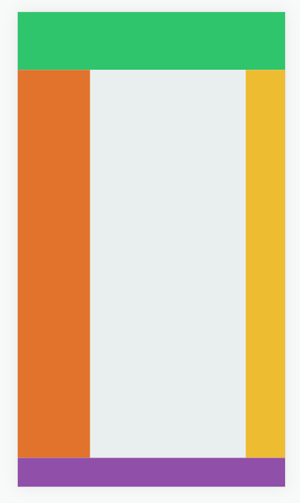

```html
<style>
  * {
    padding: 0;
    margin: 0;
  }

  body {
    width: 100vw;
    height: 100vh;
    display: grid;
    grid-template-rows: 80px 1fr 50px;
    grid-template-columns: 100px 1fr 60px;
    grid-template-areas:
      "header header  header"
      "nav main  aside"
      "footer footer  footer";
  }

  main {
    /* 完整的写法，推荐使用下面的简写方式*/
    /* grid-area: main-start/main-start/main-end/main-end; */
    grid-area: main;
    background: #e9eeef;
  }

  header {
    background: #2ec56c;
    grid-area: header;
  }

  nav {
    background: #e1732c;
    grid-area: nav;
  }

  aside {
    grid-area: aside;
    background: #eebc31;
  }

  footer {
    grid-area: footer;
    background: #904fa9;
  }
</style>

<body>
    <header></header>
    <nav></nav>
    <main></main>
    <aside></aside>
    <footer></footer>
</body>
```

### 简写形式

使用`grid-template`进行栅格划分会更加简洁。

语法格式为：

```css
 grid-template:
  '栅格名称 栅格名称 栅格名称 栅格名称' 行高
  '栅格名称 栅格名称 栅格名称 栅格名称' 行高
  '栅格名称 栅格名称 栅格名称 栅格名称' 行高/列宽 列宽 列宽 列宽;
```

```css
* {
    padding: 0;
    margin: 0;
  }

  body {
    width: 100vw;
    height: 100vh;
    display: grid;
    grid-template:
      "header header header" 80px
      "nav main aside" auto
      "footer footer footer" 50px/100px auto 50px;  
  }

  main {
    grid-area: main;
    background: #e9eeef;
  }

  header {
    background: #2ec56c;
    grid-area: header;
  }

  nav {
    background: #e1732c;
    grid-area: nav;
  }

  aside {
    grid-area: aside;
    background: #eebc31;
  }

  footer {
    grid-area: footer;
    background: #904fa9;
  }


<header></header>
<nav></nav>
<main></main>
<aside></aside>
<footer></footer>
```


### 区域占位

使用一个或多个连续的`.`定义区域占位。

```html
<style>
  * {
    padding: 0;
    margin: 0;
  }

  article {
    width: 100vw;
    height: 100vh;
    display: grid;
    grid-template-rows: repeat(3, 33.3%);
    grid-template-columns: repeat(3, 33.3%);
    grid-template-areas:
      "top . ."
      "top . ."
      "bottom bottom bottom";
  }

  .top {
    background: blueviolet;
    grid-area: top;
    font-size: 35px;
    display: flex;
    justify-content: center;
    align-items: center;
    color: white;
  }

  .bottom {
    background: orange;
    grid-area: bottom;
    text-align: center;
    display: flex;
    justify-content: center;
    align-items: center;
    font-size: 35px;
  }
</style>


<article>
  <div class="top">111</div>
  <div class="bottom">222</div>
</article>
```


## 栅格流动

在容器中设置`grid-auto-flow`属性可以改变单元格排列方式。

| 选项   | 说明                 |
| ------ | -------------------- |
| column | 按列排序             |
| row    | 按行排序             |
| dense  | 元素使用前面空余栅格 |


### 基本使用
```html
<style>
  * {
    padding: 0;
    margin: 0;
  }

  article {
    width: 400px;
    height: 400px;
    display: grid;
    grid-template-rows: repeat(2, 1fr);
    grid-template-columns: repeat(2, 1fr);
    border: solid 5px silver;
    grid-auto-flow: column;
  }

  div {
    background: blueviolet;
    background-clip: content-box;
    padding: 10px;
    font-size: 35px;
    color: white;
  }
</style>

<body>
  <article>
    <div>1</div>
    <div>2</div>
    <div>3</div>
    <div>4</div>
  </article>
</body>
```


###  强制填充

当元素在栅格中放不下时，将会发生换行产生留白，使用`grid-auto-flow: row dense;`可以执行填充空白区域操作。

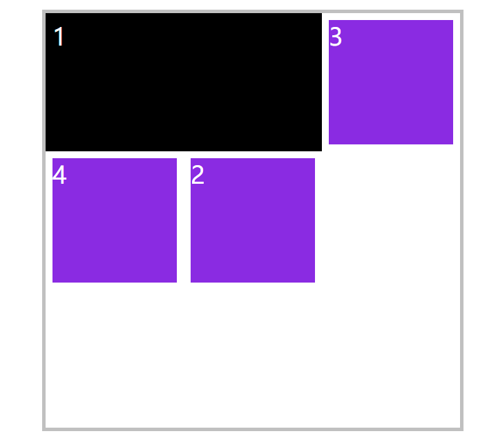

```html
<style>
  * {
    padding: 0;
    margin: 0;
  }

  body {
    padding-left: 200px;
    padding-top: 200px;
  }

  article {
    width: 600px;
    height: 600px;
    display: grid;
    grid-template-rows: repeat(3, 200px);
    grid-template-columns: repeat(3, 200px);
    border: solid 5px silver;
    grid-auto-flow: row dense;
  }

  div {
    background: blueviolet;
    background-clip: content-box;
    padding: 10px;
    font-size: 35px;
    color: white;
  }

  article div:nth-child(1) {
    grid-column: 1 / span 2;
    background: #000;
  }

  article div:nth-child(2) {
    grid-column: 2 / span 1;
  }
</style>

    
<article>
  <div>1</div>
  <div>2</div>
  <div>3</div>
  <div>4</div>
</article>
```


## 对齐管理

可以通过属性方便的定义栅格或元素的对齐方式。

| 选项            | **说明**                                         | 对象     |
| --------------- | ------------------------------------------------ | -------- |
| justify-content | 所有栅格在容器中的水平对齐方式，容器有额外空间时 | 栅格容器 |
| align-content   | 所有栅格在容器中的垂直对齐方式，容器有额外空间时 | 栅格容器 |
| align-items     | 栅格内所有元素的垂直排列方式                     | 栅格容器 |
| justify-items   | 栅格内所有元素的横向排列方式                     | 栅格容器 |
| align-self      | 元素在栅格中垂直对齐方式                         | 栅格容器 |
| justify-self    | 元素在栅格中水平对齐方式                         | 栅格容器 |


### 栅格对齐-整个网格对于容器的对齐方式

`justify-content` 与 `align-content` 用于控制栅格的对齐方式，比如在栅格的尺寸小于容器时，控制栅格的布局方式。

`justify-content`属性的值如下：

| 值            | 说明                                                         |
| ------------- | ------------------------------------------------------------ |
| start         | 容器左边                                                     |
| end           | 容器右边                                                     |
| center        | 容器中间                                                     |
|               |                                                              |
| space-between | 第一个栅格靠左边，最后一个栅格靠右边，余下元素平均分配空间   |
| space-around  | 每个元素两侧的间隔相等。所以，栅格之间的间隔比栅格与容器边距的间隔大一倍 |
| space-evenly  | 栅格间距离完全平均分配                                       |

`align-content` 属性的值如下：

| 值            | 说明                                                         |
| ------------- | ------------------------------------------------------------ |
| start         | 容器顶边                                                     |
| end           | 容器底边                                                     |
| center        | 容器垂直中间                                                 |
|               |                                                              |
| space-between | 第一个栅格靠左边，最后一个栅格靠右边，余下元素平均分配空间   |
| space-around  | 每个元素两侧的间隔相等。所以，栅格之间的间隔比栅格与容器边距的间隔大一倍 |
| space-evenly  | 栅格间距离完全平均分配                                       |

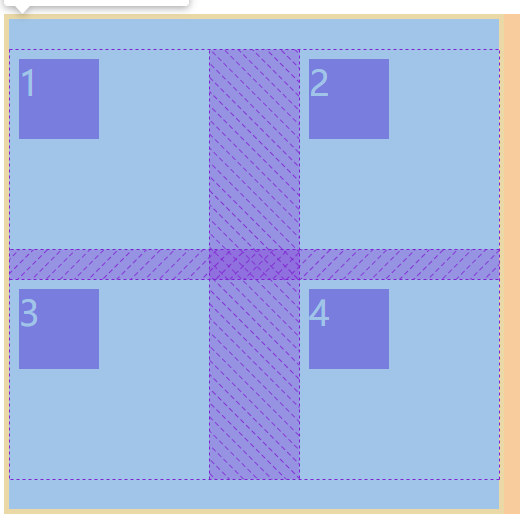

```html
<style>
  * {
    padding: 0;
    margin: 0;
    box-sizing: border-box;
  }

  body {
    padding-left: 200px;
    padding-top: 200px;
  }

  article {
    width: 500px;
    height: 500px;
    display: grid;
    grid-template-rows: repeat(2, 200px);
    grid-template-columns: repeat(2, 200px);
    border: solid 5px silver;
    justify-content: space-between;
    align-content: space-evenly;
  }

  div {
    background: blueviolet;
    background-clip: content-box;
    padding: 10px;
    font-size: 35px;
    color: white;
  }

  article div {
    width: 100px;
    height: 100px;
  }

</style>


<body>
  <article>
    <div>1</div>
    <div>2</div>
    <div>3</div>
    <div>4</div>
  </article>
</body>
```

下面是栅格水平与垂直居中对齐的示例：

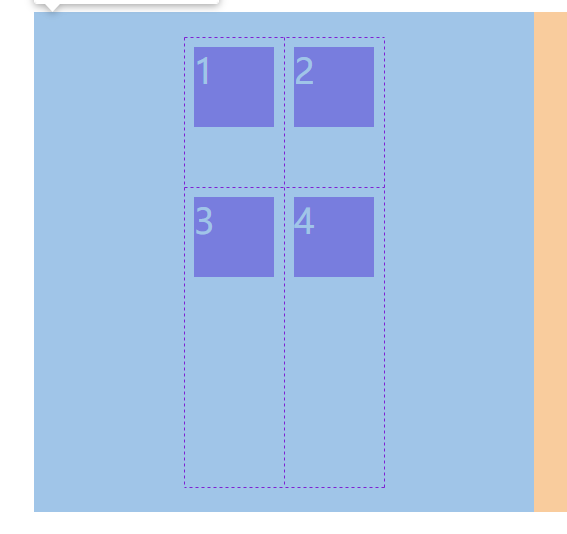

```html
<style>
  * {
    padding: 0;
    margin: 0;
    box-sizing: border-box;
  }

  body {
    padding-left: 200px;
    padding-top: 200px;
  }

  article {
    width: 500px;
    height: 500px;
    display: grid;
    grid-template: 150px 300px / 100px auto;
    justify-content: center;
    align-content: center;
  }

  div {
    background: blueviolet;
    background-clip: content-box;
    padding: 10px;
    font-size: 35px;
    color: white;
  }

  article div {
    width: 100px;
    height: 100px;
  }
</style>

<article>
  <div>1</div>
  <div>2</div>
  <div>3</div>
  <div>4</div>
</article>

```

### 元素对齐

`justify-items` 与 `align-items` 用于控制所有栅格内元素的对齐方式，栅格内的div

`justify-items` 用于控制元素的水平对齐方式，可用的属性值如下：

| 值      | 说明                 |
| ------- | -------------------- |
| start   | 元素对齐栅格的左边   |
| end     | 元素对齐栅格的右边   |
| center  | 元素对齐栅格的中间   |
| stretch | 水平撑满栅格，默认值 |

`align-items` 用于控制元素的垂直对齐方式，可用的属性值如下：

| 值      | 说明                   |
| ------- | ---------------------- |
| start   | 元素对齐栅格的顶边     |
| end     | 元素对齐栅格的底边     |
| center  | 元素对齐栅格的垂直中间 |
| stretch | 垂直撑满栅格，默认值   |

下面是将元素在所在栅格中水平、垂直居中的示例

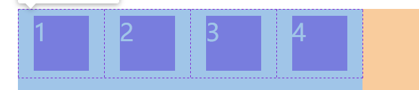

```html
article {
  width: 500px;
  height: 500px;
  display: grid;
  grid-template: 100px / repeat(4, 1fr);
  justify-items: center;
  align-items: center;
}

 article div {
    width: 100px;
    height: 100px;
  }
```
下面是所有元素在所在栅格中居中对齐的示例：

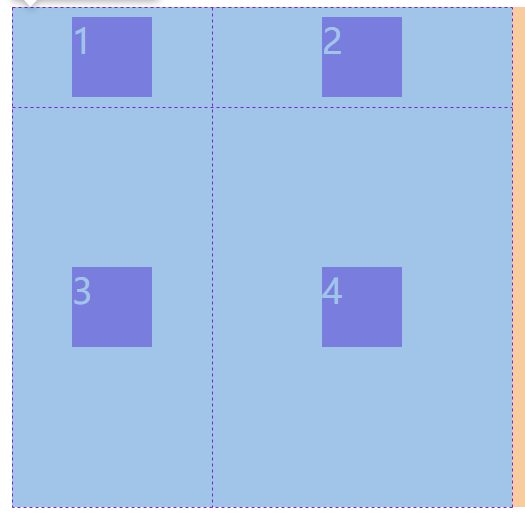

```html
<style>
  * {
    padding: 0;
    margin: 0;
    box-sizing: border-box;
  }

  body {
    padding-left: 200px;
    padding-top: 200px;
  }

  article {
    width: 500px;
    height: 500px;
    display: grid;
    grid-template: 100px 1fr / 200px 1fr;
    /* justify-content: center; */
    /* align-content: center; */
    justify-items: center;
    align-items: center;
  }

  div {
    background: blueviolet;
    background-clip: content-box;
    padding: 10px;
    font-size: 35px;
    color: white;
  }

  article div {
    width: 100px;
    height: 100px;
  }
</style>

<article>
  <div>1</div>
  <div>2</div>
  <div>3</div>
  <div>4</div>
</article>
```


### 元素独立控制

`justify-self` 与 `align-self` 控制单个栅格内元素的对齐方式，属性值与 `justify-items` 和 `align-items` 是一致的。

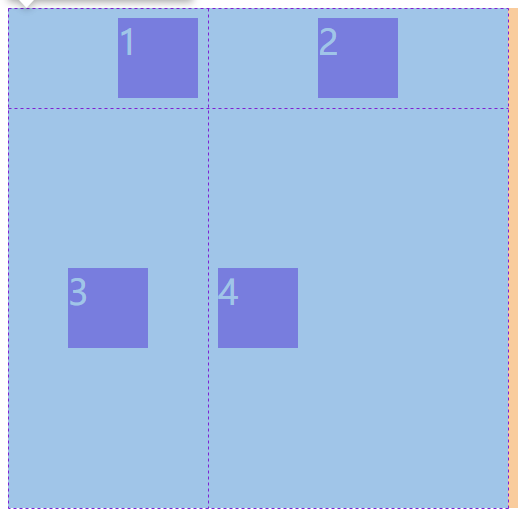

```html
<style>
  * {
    padding: 0;
    margin: 0;
    box-sizing: border-box;
  }

  body {
    padding-left: 200px;
    padding-top: 200px;
  }

  article {
    width: 500px;
    height: 500px;
    display: grid;
    grid-template: 100px 1fr / 200px 1fr;
    /* justify-content: center; */
    /* align-content: center; */
    justify-items: center;
    align-items: center;
  }

  div {
    background: blueviolet;
    background-clip: content-box;
    padding: 10px;
    font-size: 35px;
    color: white;
  }

  article div {
    width: 100px;
    height: 100px;
  }

  div:first-child {
    justify-self: end;
    align-self: center;
  }

  div:nth-child(4) {
    justify-self: start;
    align-self: center;
  }
</style>
```


### 组合简写

`place-content`

用于控制栅格的对齐方式，如下：

```css
place-content: <align-content> <justify-content>
```

`place-items`

控制所有元素的对齐方式，如下：

```css
place-items: <align-items> <justify-items>
```

`place-self`

控制单个元素的对齐方式

```css
place-self: <align-self> <justify-self>
```


## 自动排列

当栅格无法放置内容时，系统会自动添加栅格用于放置溢出的元素，使用以下属性控制自动添加栅格的尺寸。

### 属性说明

| 选项              | 说明                                                   | 对象 |
| ----------------- | ------------------------------------------------------ | ---- |
| grid-auto-rows    | 控制自动增加的栅格行的尺寸，grid-auto-flow:row; 为默认 | 容器 |
| grid-auto-columns | 控制自动增加的栅格列的尺寸，grid-auto-flow: column     | 容器 |

### 自动栅格行

下面定义了 2X2 的栅格，但有多个元素，系统将自动创建栅格用于放置额外元素。使用 grid-auto-rows 来控制增加栅格的行高。

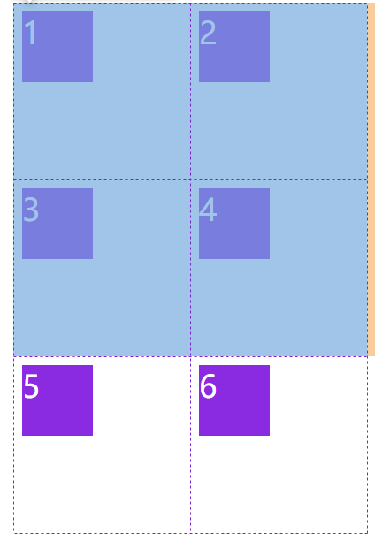

```html
<style>
  * {
    padding: 0;
    margin: 0;
    box-sizing: border-box;
  }

  body {
    padding-left: 200px;
    padding-top: 200px;
  }

  article {
    width: 400px;
    height: 400px;
    display: grid;
    grid-template-rows: repeat(2, 200px);
    grid-template-columns: repeat(2, 200px);
    grid-auto-rows: 200px;
    grid-auto-columns: 200px;
  }

  div {
    background: blueviolet;
    background-clip: content-box;
    padding: 10px;
    font-size: 35px;
    color: white;
  }

  article div {
    width: 100px;
    height: 100px;
  }
</style>

<article>
  <div>1</div>
  <div>2</div>
  <div>3</div>
  <div>4</div>
  <div>5</div>
  <div>6</div>
</article>
```


### 自动行列

下面创建了 2X2 栅格，将第 2 个 DIV 设置的格栅已经超过了四个栅格，所以系统会自动创建栅格。

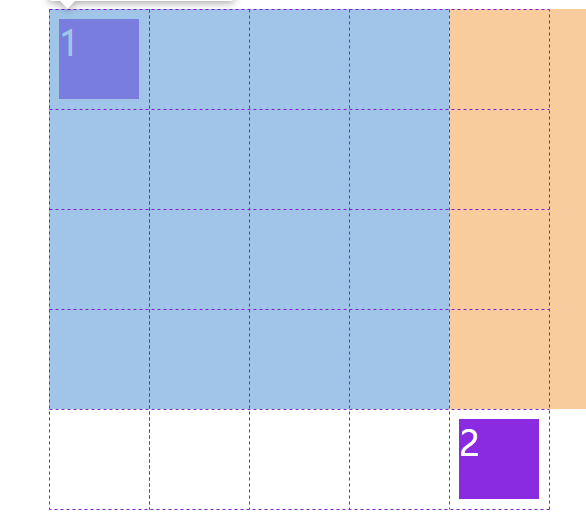

```html
<style>
  * {
    padding: 0;
    margin: 0;
    box-sizing: border-box;
  }

  body {
    padding-left: 200px;
    padding-top: 200px;
  }

  article {
    width: 400px;
    height: 400px;
    display: grid;
    grid-template-rows: repeat(2, 100px);
    grid-template-columns: repeat(2, 1fr);
    grid-auto-columns: 100px;
    grid-auto-rows: 100px;
  }

  div {
    background: blueviolet;
    background-clip: content-box;
    padding: 10px;
    font-size: 35px;
    color: white;
  }

  article div {
    width: 100px;
    height: 100px;
  }
  div:nth-child(2) {
    grid-area: 5/6/5/6;
  }
</style>


<article>
  <div>1</div>
  <div>2</div>
</article>
```


## 实战


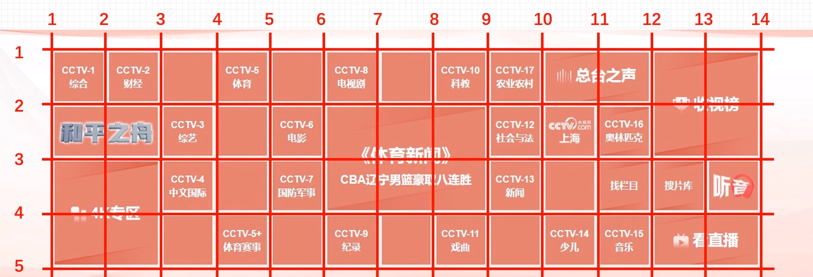
